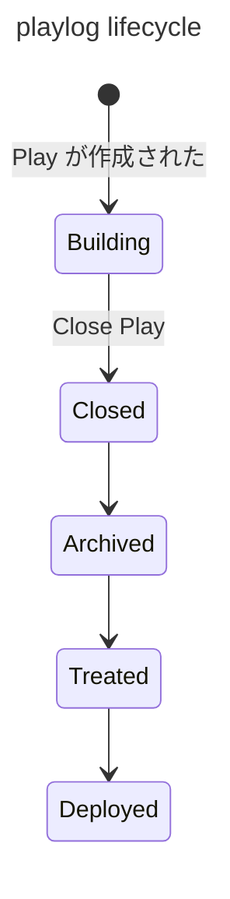

## Play の状態とその Playlog のアーカイブライフサイクル



## 各状態の説明

- Playlog はどこに保存されているか
- Playlog Client はどこから Playlog を取得するか

使用できる [Playlog Store](https://github.com/akashic-games/akashic-system/tree/development/packages/playlog-store/src) と操作:

| state    | StoreClient | put | update | get | scan |
| -------- | ----------- | --- | ------ | --- | ---- |
| Building | FerretDB    | ◯   | ◯      | ◯   | ◯    |
| Closed   | FerretDB    | ×   | ×      | ◯   | ◯    |
| Archived | ?           | ×   | ×      | ?   | ?    |
| Treated  | S3          | ×   | ×      | ?   | ?    |
| Deployed | S3 / HTTP   | ×   | ×      | ◯   | ?    |

PlaylogStore は保存をすることがそのインターフェースの主体であるから、 Archived 以降の状態の Playlog に対応するものは、Store ではないのでは…？と考えるかもしれません。
たしかに Akashic の思想上ではたしかに Close された以降の Playlog は変更不可能ですが、実装としては「やれなくはない」ので PlaylogStore です。
現実問題として実装するかどうかは、また別の問題です。

### Building

Play が作られてから Close されるまでの状態です。
まだ Active AE が存在し、Playlog に書き込み可能です。

この状態では、まだ FerretDB 上にデータが存在しており、Get も Subscribe もできます。

### Closed

Play は Close され、変更されなくなった状態です。

FerretDB 上に存在し、そこから取得できます。

### Archived

S3 へアーカイブされた状態です。
Play 単位での取得が可能かは未定義です。

FerretDB から取得できるかは未定義です。

この状態では、複数の Playlog をまとめてひとつの BSON ファイルにした状態で S3 バケットの `/playlogs` や `/startpoints` に保存されています。

この状態では、PlayID を指定した取得ができません。
データベースを参照するなどして、参照したい Playlog が含まれているファイルを特定し、その BSON ファイルから抽出する必要があります。

現在は、日次で PlayID １万件ごとに BSON としてダンプし、３日に１回の頻度で S3 にアップロードしています。

### Treated: 未実装

Archive された Play を PlayID ごとのファイルに分割したり、メタデータを作成したりした状態です。

S3から取得できます。

この状態では、PlayID ごとに１つのファイルでアーカイブされています。
S3 バケットの `/split_by_id` 以下に PlayID のディレクトリがあり、その下に使用目的に応じた `playlog.bson` `playlog.json` `startpoint.json` `meta.json` などが保存されています。

- playlog.json: Akashic Engine や Playlog Server が playlog をそのままデータとして使用する。
- startpoint.json: Akashic Engine や Playlog Server が startpoint をそのままデータとして使用する。
- meta.json: フレーム数など、RDB には保存されていない Playlog 自体のメタデータ。
- playlog.bson: そのまま FerretDB にインポートする。
- startpoint.bson: そのまま FerretDB にインポートする。
- playlog.metadata.json: FerretDB にインポートする際に使用する、mongodump 時に生成されるファイル。

#### playlog.json example

```json
[
  {
    "playId": "95324293",
    "frame": "0",
    "data": ""
  },
  {
    "playId": "95324293",
    "frame": "1",
    "data": ""
  },
  {
    "playId": "95324293",
    "frame": "2",
    "data": ""
  }
]
```

#### startpoint.json example

```json
{
  "playId": "95324291",
  "frame": "0",
  "startPoint": ""
}
```

#### meta.json example

運用してて必要になった情報をいれてます。
ここに含める情報の基準は「Closed になるまで確定せず、Playlog をすべてロードしないとわからない」です。

closedAt ではなく endAt なのは、Playlog の終端がこの時間なのであって、Close された時間ではないからです。

```json
{
  "playlog": {
    "frameCount": 129512,
    "endAt": "2024-09-30T23:59:00.0000Z"
  }
}
```

### Deployed: 未実装

インターネット上に公開されており、だれでも PlayID を指定して取得できる状態です。

// todo: 実際にアクセス可能になったら、ここに具体的な URL の例を追加する

Treated 状態で使っている S3 バケットの `/split_by_id` 以下がそのまま CloudFront 経由でアクセスできるようになっています。そのため、Treated 状態はほんの数秒間しか使われないでしょう。

将来的に他の CDN を使用するようになった場合や、各ロケーションのエッジへ配信する必要が出てきた場合に、この Deployed になるまで時間がかかるようになるかもしれません。
