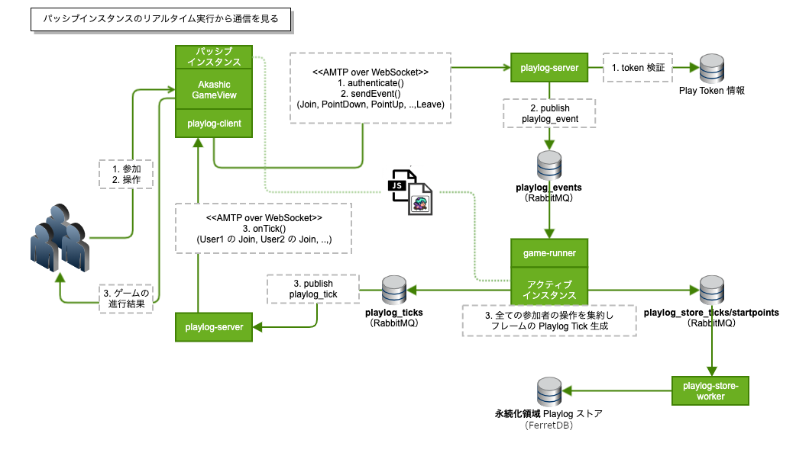
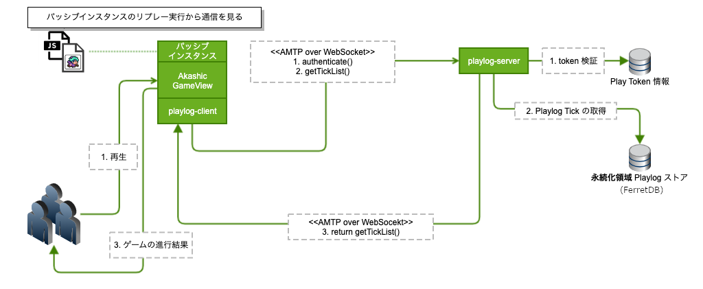
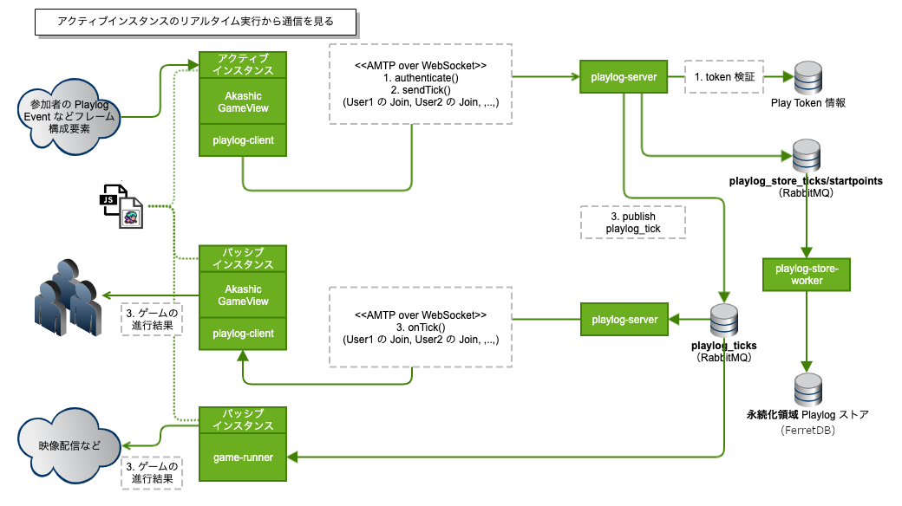

## Akashic システムの実行方式と権限

Akashic システムの利用者は、「リアルタイム実行」や「リプレー」など、**プレーの実行方式に応じた [プレートークン](../reference/plays_tokens.md) でプレーヤーに権限を与える** 必要があります。

Akashic システムの実行方式と権限について説明します。

## 用語

Akashic
として公開されている用語については、以下の説明とリンク先をご覧ください。ここでは
Akashic の実現形態の一つである「Akashic
システムとしての特性」について記述します。

<table class="relative-table wrapped" style="width: 100.0%;">
<colgroup>
<col style="width: 19%" />
<col style="width: 52%" />
<col style="width: 28%" />
</colgroup>
<tbody>
<tr class="header">
<th>用語</th>
<th>説明</th>
<th>リンク</th>
</tr>

<tr class="odd">
<td>Playlog</td>
<td>広義には「Akashic が記録し再現するもの」、狭義には右のリンク先にある仕様を指す。</td>
<td><a href="https://github.com/akashic-games/playlog">playlog</a></td>
</tr>
<tr class="even">
<td>Playlog Event</td>
<td>Playlog の構成要素。プレーヤー参加・離脱や、ポイントダウン・アップなどを表す。</td>
<td><a href="https://github.com/akashic-games/playlog#event">playlog#event</a></td>
</tr>
<tr class="odd">
<td>Playlog Tick</td>
<td>Playlog の構成要素。ゲームの 1 フレームを実行するために必要なデータ。複数の Playlog Event を内包する。</td>
<td><a href="https://github.com/akashic-games/playlog#tick">playlog#tick</a></td>
</tr>
<tr class="even">
<td>Start Point</td>
<td>Playlog の開始地点情報。複数の開始地点を定めることができる。</td>
<td><a href="https://github.com/akashic-games/amflow">amflow</a></td>
</tr>
<tr class="odd">
<td>Akashic Message Flow (<strong>AMFlow</strong>) </td>
<td><p>Akashic で共通に利用されるデータをやりとりするためのインターフェース。</p>
<ul>
<li>authenticate() によるトークン別のセッション開始、close() による終了</li>
<li>sendTick(), sendEvent(), putStartPoint() による送信</li>
<li>onTick(), onEvent(), getStartPoint による受信</li>
</ul>
<p>このインタフェースを実現するものとして、以下に述べる <strong>AMTP</strong> がある。（AMFlow over AMTP）</p></td>
<td><a href="https://github.com/akashic-games/amflow">amflow</a></td>
</tr>
<tr class="even">
<td><p>Akashic Message Transfer Protocol (<strong>AMTP</strong>)</p></td>
<td><p>Akashic の通信プロトコル。一つのコネクション上に Channel, Pipe と呼ばれる仮想通信路を確立、多重化を実現する。現在、WebSocket 実装が実用されている。（AMTP over WebSocket）</p>
<p>通常、Akashic システム利用者はこれを意識することはありません。AMFlow の実装という位置付けです。</p></td>
<td><a href="https://github.com/akashic-games/akashic-system/blob/main/packages/amtplib/doc/amtp-v1-spec.md">AMTP</a></td>
</tr>
<tr class="odd">
<td>Playlog Client</td>
<td><p>AMFlow のクライアント実装。AMTP over WebSocket で実現されている。</p></td>
<td><a href="https://github.com/akashic-games/akashic-system/tree/main/packages/playlog-client">PlaylogClient</a></td>
</tr>
<tr class="even">
<td>Playlog Server</td>
<td><p>AMFlow のサーバ実装。AMTP over WebSocket で実現されている。</p></td>
<td><a href="https://github.com/akashic-games/akashic-system/tree/main/servers/playlog-server">PlaylogServer</a></td>
</tr>
<tr class="odd">
<td>アクティブ・パッシブ</td>
<td><p>プレーヤーの Playlog Event を集約し、1 フレームごとに Playlog Tick を生成・配信するものを「アクティブ」とし、配信された Tick に追従することを「パッシブ」とする。特に前者のゲーム実行体は「<strong>アクティブインスタンス</strong>（古い記述では Active AE）」と呼ばれる。</p>
<p>ある Play につき、アクティブインスタンスは一つでなければならない。Akashic システムを介するとき、初回に生成したアクティブインスタンスのみ実行可能であり、以降のアクティブ作成は実行エラーとなる。</p></td>
<td></td>
</tr>
<tr class="even">
<td>サーバループ</td>
<td><p>アクティブインスタンスが <strong>Akashic システムに存在する</strong>ことを便宜上こう呼ぶことがある。</p>
<ul>
<li><a href="../reference/specification_parameters.md#code-dynamicPlaylogWorker">サーバのインスタンス API でアクティブを指定</a>する。</li>
</ul></td>
<td></td>
</tr>
<tr class="odd">
<td>クライアントループ</td>
<td><p>アクティブインスタンスが <strong>Akashic システムに存在しない</strong>ことを便宜上こう呼ぶことがある。クライアント・サーバモデルのクライアントに限定するものではないことに注意。</p>
<ul>
<li><a href="https://github.com/akashic-games/agvw/blob/main/README.md">Akashic GameView の executionMode でアクティブを指定</a>する。このとき、サーバ接続設定を省略しスタンドアロンモードとして実行することができるが、システムを介さない都合上、クライアントループと区別されることが多い。</li>
<li>その性質上、アクティブインスタンスが生成・送信した Playlog Tick が信頼できるものか、Akashic システムでは厳密に担保されない。</li>
</ul></td>
<td><a href="https://github.com/akashic-games/agvw">agvw</a></td>
</tr>
<tr class="even">
<td>リアルタイム実行</td>
<td><p>リアルタイムでアクティブインスタンスの Playlog Tick に追従すること。これを実現するものを Playlog Stream と呼ぶことがある。</p>
<ul>
<li><a href="../reference/specification_parameters.md#permission">権限</a>の <strong>subscribeTick</strong> に相当する。</li>
<li>status: running の Play でのみ有効である。</li>
</ul></td>
<td> </td>
</tr>
<tr class="odd">
<td>リプレー</td>
<td><p>過去に保存された Playlog Tick を再現すること。厳密にはリアルタイム実行も直前の Playlog Tick に追従するという意味でリプレーの範疇ではある。Akashic システムとしては「subscribeTick = Playlog Stream を使わない追従」のことを指し、権限およびバックエンドの経路が分けられている。</p>
<ul>
<li><a href="../reference/specification_parameters.md#permission">権限</a>の <strong>readTick</strong> に相当する。</li>
</ul></td>
<td> </td>
</tr>
</tbody>
</table>

## 権限

ここでは代表的な実行方式に[必要な権限](../reference/specification_parameters.md#permission)をまとめます。

|            |                  |          |               |                |           |           |
| ---------- | ---------------- | -------- | ------------- | -------------- | --------- | --------- |
| 対象       | 実行方式         | readTick | subscribeTick | subscribeEvent | sendEvent | writeTick |
| パッシブ   | リアルタイム実行 | true     | true          | false          | true      | false     |
| パッシブ   | リプレー         | true     | false         | false          | false     | false     |
| アクティブ | リアルタイム実行 | true     | false         | true           | false     | true      |

## 実行方式

ここでは代表的な実行方式を図示します。

### パッシブインスタンスのリアルタイム実行

サーバループの例。Akashic GameView を **ExecutionMode: Passive**
とし、サーバのインスタンス API で Active
を作成したケースのリアルタイム実行通信は以下の通り。



このモードから[パッシブインスタンスに求められる権限](../reference/specification_parameters.md#permission)は次の通り。

```js
{
  sendEvent: true,
  subscribeTick: true
}
```

- AMTP over WebSocket
  では、参加者のイベント入力を **AMFlow\#sendEvent()** で送信し、ゲームの進行結果を **AMFlow\#onTick()** で受信する。
- Start Point はアクティブインスタンスによって書き込まれたものが返る。
- 実際には後述のリプレー特性も含めて `readTick: true` も使われる。（デフォルトで有効のため API で直接指定しなくて良い）

### パッシブインスタンスのリプレー実行

サーバループの例。Akashic GameView を **ExecutionMode: Replay** とし、サーバで既に Playlog Tick が生成済みのケースの通信は以下の通り。単にリプレーのみを目的とする場合はサーバインスタンスは不要である。終了したプレーの再現のほか、プレーの途中から再現したいときに「最新フレームまで高速実行する」などの用途でも利用される。



このモードから[パッシブインスタンスに求められる権限](../reference/specification_parameters.md#permission)は次の通り。

```js
{
  readTick: true;
}
```

- AMTP over WebSocket
  では、ゲームの進行結果を **AMFlow\#getTickLIst()** で受信する。

### アクティブインスタンスのリアルタイム実行

クライアントループの例。

Akashic GameView の **ExecutionMode: Active** とし、サーバのインスタンス API で Passive を作成したケースのリアルタイム実行通信は以下の通り。



このモードから[アクティブインスタンスに求められる権限](../reference/specification_parameters.md#permission)は次の通り。

```js
{
  writeTick: true,
  subscribeEvent: true
}
```

- AMTP over WebSocket
  では、ゲームの進行結果を **AMFlow\#sendTick()** で送信し、参加者のイベントを **AMFlow\#onEvent()** で受信する。
- Start Point はアクティブインスタンスによって書き込まれたものが返る。
- 実際にはリプレー特性も含めて<u>**「readTick:
  true」**</u>も使われる。（デフォルトで有効のため API
  で直接指定しなくて良い）
