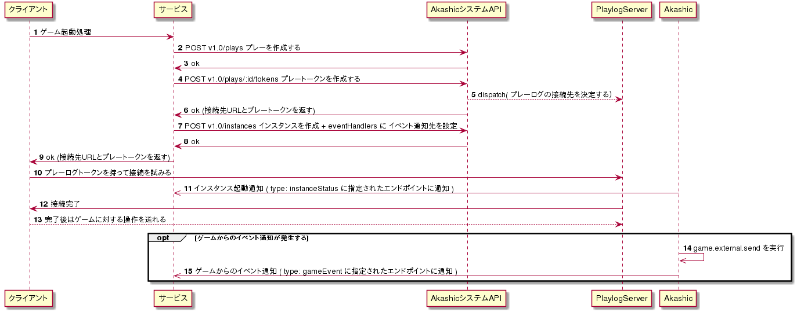

## Akashicからイベントの通知を受け取りたい

ここでは、以下のような要求がある時のシーケンスを示します。

- Akashicで実行しているゲームから、なんらかの結果を受け取りたい
  - 例：アンケートを行った集計結果を受け取りたい、多人数参加ゲームのスコアランキングを受け取りたい
- Akashic側の異常を受けてハンドリングを行いたい
  - 例：
    エラーが発生した時に、生放送主にエラーが起きた事を通知したい

 

## イベントハンドラを使う

[インスタンス作成](../reference/instances.md)のときに [eventHandlers モジュール](../reference/specification_parameters.md#code-eventhandlers) を指定することで、システムからの通知を受け取る事ができます。

