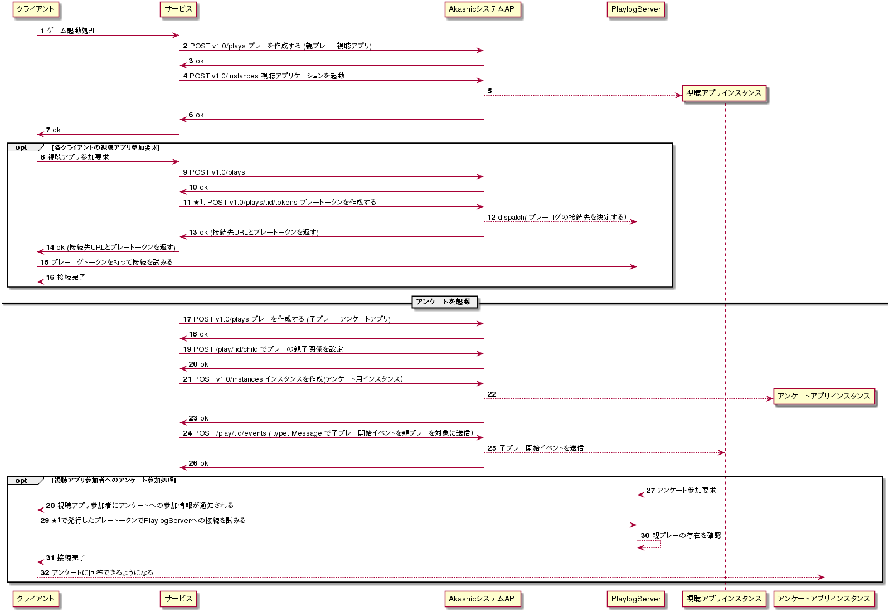

## プレートークン発行負荷の低減

Akashic システムで動作させるために必要な [プレートークン](../reference/plays_tokens.md) は、特に API リクエスト数が高くなりがちです。
**あるプレーに 1,000 人を参加させるとき、1,000 人分のプレートークン作成リクエストが発生**します。参加人数に応じて API リクエストを捌けるだけのサーバリソースが必要となります。

この負荷を軽減するため、**事前に発行したプレートークンを新たなプレートークンに引き継いで使用**することができます。

ゲーム起動時のプレートークン発行負荷を低減するため、「親」と「子」のプレー構造を適用しています。
（ニコ生で使われていた名残です。現状使わなければならないものではありません。）

- 親：ニコ生番組に対応したプレーを作成
  - ニコニコ生放送の視聴者は視聴開始時にプレートークンを作成する
- 子：ニコ生番組の中で起動するゲームに対応したプレーを作成
  - ニコ生ゲームの参加者は番組視聴開始時に得た親のプレートークンをそのまま子に引き渡し認可する
  - **子プレーではトークンを発行しないため凸負荷は発生しない**

### 親子関係を利用する例

[COE フレームワーク](https://github.com/akashic-games/coe/blob/master/getstarted.md)を使ったシステムによるアンケート起動の例を示します。

ここでは、親となる視聴アプリケーションのプレーとインスタンスを作成して、その子としてアンケート用のプレーを作成しています。

アンケートのプレーに接続する時には、アンケート用のプレートークンを発行せず、親の視聴アプリケーションのものを使い接続を行います。

