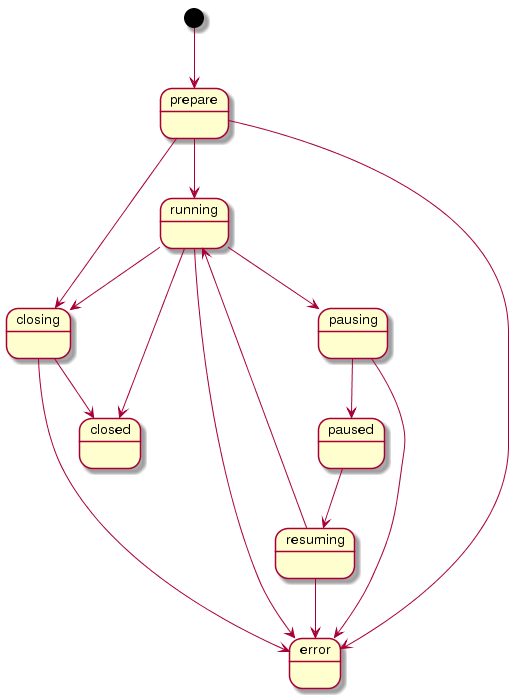

# インスタンス状態仕様

## 概要

[インスタンス](instances.md)の状態を示す値について定義する。

## 一覧

<table class="wrapped">
<tbody>
<tr class="header">
<th>No</th>
<th>識別名</th>
<th>解説</th>
<th>備考</th>
</tr>

<tr class="odd">
<td>1</td>
<td>prepare</td>
<td>インスタンスの作成指令を受けて、起動準備を行っている状態</td>
<td> 
</td>
</tr>
<tr class="even">
<td>3</td>
<td>running</td>
<td>インスタンスが稼働中</td>
<td> 
</td>
</tr>
<tr class="odd">
<td>4</td>
<td>pausing</td>
<td>インスタンス実行一時停止指令を受けて、一時停止状態(paused)に遷移中の状態</td>
<td> 
</td>
</tr>
<tr class="even">
<td>5</td>
<td>paused</td>
<td>インスタンス実行を一時停止している状態</td>
<td> 
</td>
</tr>
<tr class="odd">
<td>6</td>
<td>resuming</td>
<td>インスタンス実行一時停止解除指令を受けて、稼働状態(running)に遷移中の状態</td>
<td> 
</td>
</tr>
<tr class="even">
<td>7</td>
<td>closing</td>
<td>インスタンスの終了作業中</td>
<td> 
</td>
</tr>
<tr class="odd">
<td>8</td>
<td>closed</td>
<td>インスタンスが正常終了</td>
<td> 
</td>
</tr>
<tr class="even">
<td>9</td>
<td>error</td>
<td>エラーでの強制終了</td>
<td>サーバ障害/割り当て失敗/プログラム異常終了などで発生</td>
</tr>
</tbody>
</table>

## インスタンスの状態遷移図

## prepare状態

インスタンスレコードは作成されたが、サーバ側で割り当てリソースを確保中の状態。  
起動直後はこの状態となる。  
将来的にサーバ側異常時の再割当てによる継続処理が発生した場合もこの状態になる可能性がある。

## running状態

サーバ側でリソースが確保され、プログラムが稼働中の状態。

## pausing状態

インスタンスの一時停止指令を出した時にこの状態になる。

サーバ側で、実行中のインスタンスに対してスクリプト実行の一時停止処理をしている状態。

一時停止処理処理が正常に完了すると、paused 状態に遷移する。

## paused状態

インスタンス上でのスクリプト実行が一時停止されている状態。

## resuming 状態

インスタンスの一時停止解除指令を出した時にこの状態になる。

サーバ側で、実行中のインスタンスに対してスクリプトの実行再開を処理している状態。

実行再開処理が正常に完了すると、running 状態に遷移する。

## closing状態

インスタンスの終了指令を出した時にこの状態になる。  
サーバ側に割り当て解除を指示している状態 。

## closed状態

インスタンスが完全に終了した状態を表す。末端状態であり、この状態から遷移する事はない。

## error状態

インスタンスがなんらかの事情で異常終了した状態を表す。末端状態であり、この状態から遷移する事はない。
