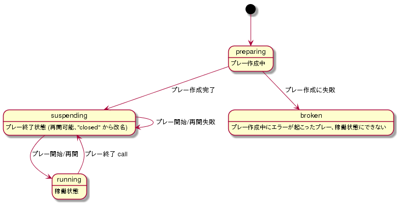

# プレー状態仕様

## 概要

プレーの状態を示す値について定義する。

## 一覧

| No  | 識別名     | 解説                                                             | 備考                                                                          |
| --- | ---------- | ---------------------------------------------------------------- | ----------------------------------------------------------------------------- |
| 1   | preparing  | プレー作成中の状態。                                             | 開始状態。                                                                    |
| 2   | running    | プレー中状態。クライアントまたはサーバでゲームが動いている状態。 | この状態では、リアルタイムにプレーの Tick や Event を送受信することができる。 |
| 3   | suspending | プレー終了済状態。 ”続きからプレー" として再開させることが可能。 | この状態では、既に終了したプレーの Tick 読み込みに限り行える。（ 参照）       |
| 4   | broken     | プレー作成時にエラーが発生し、開始することができない状態。       | 末端状態であり、この状態から他の状態に遷移することはない。                    |

## プレーの状態遷移図

